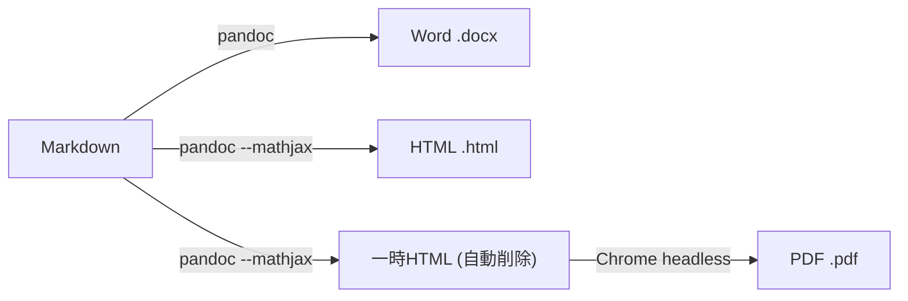

# はじめに

文章作成を Markdown で行っている場合, 困るのが「Word や PDF で提出してください」という場合です. Markdown ファイルを開いて Word にコピー & ペーストして体裁を整えて... という作業は, 頻繁に発生する割には手間がかかり過ぎます.

本記事では, **Pandoc** と **Google Chrome (ヘッドレスモード)** を使って Markdown を Word・PDF・HTML に変換するコマンドを整備します. さらに, どのディレクトリからでも呼び出せるよう zsh の関数として登録します.

また, 「普段は Word で文章を書いている」という方に向けて, Markdown への乗り換えの話も少し書きます. Markdown で書いても Word や PDF に出力できる, というのが, その背中を押す一つになれば幸いです.

## 対象読者

- **Markdown ユーザー**
  - Word や PDF での提出が求められるたびに手間を感じている方
- **Word ユーザー**
  - 文章作成の効率を上げたい方. Markdown? なにそれ? という方も.
- **ターミナルを使ったことがある程度の方**
  - shell等の知識が無くても大丈夫ですが, `brew install` や `source ~/.zshrc` 程度の知識があるとスムーズです.

---

# 前段: Markdownで文章作成しよう

:::message
すでに Markdown を使っている方は [次のセクションまでスキップ](#変換結果のプレビュー) してください.
:::

## Markdownとは

Markdown は, シンプルな記法でドキュメントを書ける軽量マークアップ言語です. テキストファイルに少しの記号を加えるだけで, 見出し・箇条書き・太字・コードブロックなどを表現できます.

```markdown
# 見出し1
## 見出し2

- 項目A
- 項目B

**太字**, *斜体*, ~~打ち消し線~~, `コード` の例です.

数式も書けます.
$$
\begin{align}
P^* = \frac{6\nu}{\pi} {\langle \frac{x_{\text{final}} - x_{\text{initial}}}{L_c} \rangle}_{\text{chains}}
\end{align}
$$

```

VSCodeやObsidianなど多くのエディタで, Markdownプレビューをリアルタイムに確認できます.

## Word より Markdown が良い点

- **どこでも編集できる/閲覧できる**
  - テキストファイルなので, エディタを選びません.
  - Wordの場合はMicrosoft Wordが無ければ閲覧も編集もできませんが, Markdownならスマホでもブラウザでも編集できます. 
  - WordはWindows/Mac間の互換性も, バージョンによる互換性も完璧ではありませんが, Markdownはどこでも同じです.
- **バージョン管理と相性が良い**
  - Git でそのまま管理できます. (Wordはバイナリファイルなので差分が非常に見づらい)
  ※ Gitは後から始めても大丈夫です. まずはMarkdownに慣れることを優先しましょう.

https://zenn.dev/masa0902dev/articles/lab-git-github

- **内容に集中できる**
  - フォントや余白など体裁を気にせず, 執筆に集中できます.
- **軽量で高速**
  - 大きなファイルでもサクサク編集できます.
  - ファイル容量自体よりも, Wordのソフトウェアの重さと操作性の悪さが効率を下げる.
- **変換が容易**
  - Word,PDF,HTML,LaTeX,…など様々な形式に変換できます.

## 「でも提出は Word が求められる...」

**Markdown で書いても, Word や PDF に一瞬で変換できます.** 以降でその方法を紹介します.


---

# 変換結果のプレビュー

先に変換結果をお見せします. 実用に耐える見た目であることを確認してください.
(余白を増やすのは`<br>`を使えば容易に可能ですし, その他見た目の調整も色々可能です. 今回はデフォルトの見た目を示しています.)

:::details 見た目

Word ↓


PDF ↓


HTML ↓


元のMarkdown ↓

````md
---
title: Markdown to Word,PDF,HTML
author: masa0902dev
date: 2026-06-11
---

# 見出し1：変換テスト

これはMarkdownからWord,HTML,PDFへの変換をテストするための文章です.


## 見出し2：テキスト装飾

通常のテキストです。**太字**、*斜体*、~~打ち消し線~~、`インラインコード` が含まれます。


## 見出し2：リスト

### 見出し3: 箇条書きリスト

- 項目A
- 項目B
  - 項目B-1
  - 項目B-2
- 項目C

### 見出し3: 番号付きリスト

1. 手順1
2. 手順2
   1. 手順2-1
   2. 手順2-2
3. 手順3


## 見出し2：コードブロック

```py
def greet(name: str) -> str:
    return f"Hello, {name}!"

print(greet("世界"))
```

## 見出し2：数式
### 見出し3: インライン数式
インライン数式も$a=10, c=a\cdot b$ とか $\sum _{i=1}^n i = \frac{n(n+1)}{2}$ のように書けます.

### 見出し3: ブロック数式
ブロック数式も. Latexのパッケージは限られているが, Wordよりはずっとマシ.

$$
\begin{align}
P^* = \frac{6\nu}{\pi} {\langle \frac{x_{\text{final}} - x_{\text{initial}}}{L_c} \rangle}_{\text{chains}}, \\
q_6 = \frac{1}{N} \sum_{i=1}^N \sqrt{ \frac{4\pi}{13} \sum_{m=-6}^6 \left| \frac{1}{n(i)} \sum_{j=1}^{n(i)} Y_{6,m}(\mathbf{r_{ij}}) \right|^2 }.
\end{align}
$$

イコールの位置を揃えるのも可能. 行列ももちろん可能.
$$
\begin{align}
\text{MSD}(t) &= \langle |\mathbf{r}(t) - \mathbf{r}(0)|^2 \rangle \nonumber \\
&= \frac{1}{N} \sum_{i=1}^N |\mathbf{r_i}(t) - \mathbf{r_i}(0)|^2 \\
M = \begin{pmatrix}
% 
a_{11} & a_{12} & \dots & a_{1n} \\
a_{21} & a_{22} & \dots & a_{2n} \\
\vdots & \vdots & \ddots & \vdots \\
a_{n1} & a_{n2} & \dots & a_{nn}
\end{pmatrix}
\end{align}
$$


## 見出し2：リンクと画像

[Pandoc公式サイト](https://pandoc.org) へのリンクです。

変換後も画像がちゃんと表示されます. サイズ指定も`(width=150px)`のように可能.

{width=150px}


## 見出し2：水平線

---


## 見出し2：表

| 列1    | 列2    | 列3    |
| ------ | ------ | ------ |
| セルA1 | セルB1 | セルC1 |
| セルA2 | セルB2 | セルC2 |
| セルA3 | セルB3 | セルC3 |


````

:::


---

# 動作環境

- macOS Tahoe 26.5.1
- zsh 5.9 (bash可能)
- その他
  - Pandoc 3.9.0.2
  - Google Chrome Version 148.0.7778.217 (headlessで使用)

---

# ツールのインストール

## Pandoc (Word,HTML変換)

Pandoc は Markdown をはじめ, 多くのドキュメント形式を相互変換できるツールです.

```bash
brew install pandoc
```

## Google Chrome (PDF変換)

PDF 変換には Google Chrome をヘッドレスモード (画面を表示せずに実行するモード) で使用します. 別途のインストールは不要ですが, Google Chrome がインストールされている必要があります.

:::message
PDF 変換には LaTeX エンジン経由の方法もありますが, 日本語対応のための設定が複雑で, 見た目の調整も手間がかかります. 本記事では Chrome のレンダリングをそのまま利用するため, 設定が少なく見た目も自然です.
:::

---

# zsh関数で変換できるようにする

:::message
zsh は macOS のデフォルトシェル (ターミナルで使われるコマンド実行環境) です. `~/.zshrc` はそのシェルが起動するたびに自動で読み込まれる設定ファイルです. (bashの場合は `~/.bashrc` に同様の内容を追記してください.)
:::

`~/.zshrc` に以下を追記してください. ファイルが無い場合は作成してください.
VSCodeでは`code ~/.zshrc`でエディタ内にファイルを開けます.

```zsh
# Google Chrome の実行ファイルパス (macOS デフォルトのインストール先)
_MD_CHROME_PATH="/Applications/Google Chrome.app/Contents/MacOS/Google Chrome"

function md2docx() {
  local dir="$(dirname "$1")"
  local base="${${2%.*}:-$(basename "${1%.*}")}"
  local out="$dir/$base.docx"
  pandoc "$1" -o "$out" \
  && echo -n "✅md2docx:$out " || echo -n "❌ md2docx:failed ";
}
function md2html() {
  local dir="$(dirname "$1")"
  local base="${${2%.*}:-$(basename "${1%.*}")}"
  local out="$dir/$base.html"
  pandoc "$1" -o "$out" --standalone --mathjax \
  && echo -n "✅md2html:$out " || echo -n "❌ md2html:failed ";
}
function md2pdf() {
  local abs_dir="${$(dirname "$1"):A}"
  local base="${${2%.*}:-$(basename "${1%.*}")}"
  local html_tmp="$abs_dir/${base}._tmp_.html"
  pandoc "$1" -o "$html_tmp" --standalone --mathjax > /dev/null 2>&1 \
  || { echo -n "❌ md2pdf:failed "; return 1; }
  "$_MD_CHROME_PATH" --headless --disable-gpu --virtual-time-budget=10000 \
    --print-to-pdf="$abs_dir/$base.pdf" \
    "file://$html_tmp" > /dev/null 2>&1
  local code=$?
  rm -f "$html_tmp"
  [[ $code -eq 0 ]] \
  && echo -n "✅md2pdf:$abs_dir/$base.pdf " || echo -n "❌ md2pdf:failed ";
}
function md2all()   { md2docx "$1" "$2"; md2html "$1" "$2"; md2pdf "$1" "$2"; }
function md2rmall() {
  rm -f "${1%.*}.docx" "${1%.*}.html" "${1%.*}.pdf" \
  && echo "✅ removed" || echo "❌ md2rmall:failed";
}
```

:::details コードの詳細説明
- `local dir="$(dirname "$1")"`
  入力ファイルのディレクトリパスを取得します. 例: `path/to/file.md` → `path/to`
- `${$(dirname "$1"):A}`
  `md2pdf` では Chrome に渡す `file://` URL に絶対パスが必要なため, zsh の `:A` 修飾子で絶対パスを取得しています. (`cd` を使う方法では私の環境の `chpwd` フックが発火してしまうため, この方式を採用しています.)
- `${${2%.*}:-$(basename "${1%.*}")}`
  第二引数があればそれ (拡張子付きで渡しても自動除去) を, なければ入力ファイル名から拡張子を除いたものをベース名として使います.
- `> /dev/null 2>&1`
  コマンドの出力を全て捨てます (ログを表示しないため).
- `&& echo -n "✅..." || echo -n "❌..."`
  コマンドの成功/失敗に応じてログを表示します. `-n` で改行なしにしています.
- `--standalone`
  HTML 出力に `<html>`, `<head>`, `<body>` を含む完全な HTML ファイルを生成します. これがないと Chrome で正しくレンダリングされません.
- `--mathjax`
  HTML 出力に MathJax を埋め込むオプションです. これがないと数式が正しく表示されません.
- `--virtual-time-budget=10000`
  Chrome のヘッドレスモードで JavaScript の実行が完了するまで最大10秒待つ指定です. これがないと数式の描画が終わる前に PDF 化されてしまいます.
:::

追記後は以下で反映します.

```bash
source ~/.zshrc
```


## 関数一覧

| 関数       | 説明                          |
| ---------- | ----------------------------- |
| `md2docx`  | Word (.docx) に変換           |
| `md2html`  | HTML (.html) に変換           |
| `md2pdf`   | PDF (.pdf) に変換             |
| `md2all`   | 3形式をまとめて変換           |
| `md2rmall` | 生成した docx/html/pdf を削除 |

成功時は `✅`, 失敗時は `❌` のログを表示します.

処理のフローは以下の通りです.
Word と HTML は Pandoc で直接変換します. PDF は Pandoc で一時 HTML (MathJax 付き) を生成し, それを Chrome headless で印刷した後, 一時 HTML を削除します.




## 使い方

```bash
# 基本: 入力ファイルと同じディレクトリに同名で出力
md2all path/to/file.md
# → path/to/file.docx, path/to/file.html, path/to/file.pdf

# 出力ファイル名を指定する場合 (出力先は入力ファイルと同じディレクトリ)
md2all path/to/file.md report
# → path/to/report.docx, path/to/report.html, path/to/report.pdf

# 個別に変換
md2docx path/to/file.md
md2pdf  path/to/file.md
md2html path/to/file.md

# 生成ファイルをまとめて削除
md2rmall path/to/file.md
```

---

# 見た目のカスタマイズもできます

本記事では扱いませんが, 以下のカスタマイズも可能です.

## Word のスタイルをカスタマイズする

Pandoc はリファレンス docx を指定することで, 変換後の Word ファイルのフォント・見出しスタイル・余白などを統一できます.

```bash
# リファレンス docx の雛形を生成
pandoc --print-default-data-file reference.docx > my-reference.docx

# my-reference.docx を Word で開いてスタイルを編集した後, 変換時に指定する
pandoc input.md -o output.docx --reference-doc=my-reference.docx
```

## PDF の見た目を CSS でカスタマイズする

PDF は HTML を Chrome で印刷して生成しているため, HTML に CSS を適用すれば PDF の見た目も変えられます. pandoc の `-c` (`--css`) オプションでスタイルシートを指定できます.

```bash
pandoc input.md -o output.html --standalone --mathjax -c my-style.css
```

---

# おわりに

Markdown で書いても Word や PDF に出力できるようになれば, 「提出が Word だから…」という理由で Markdown から離れる必要はなくなります.
(複雑なレイアウトや細かい体裁の調整が必要な場合は, 文章作成後にWordで微調整するのが良いでしょう.)

Markdown での執筆に慣れると, 文書作成のスピードと快適さが上がります. この記事が Markdown への移行のきっかけになれば幸いです.
